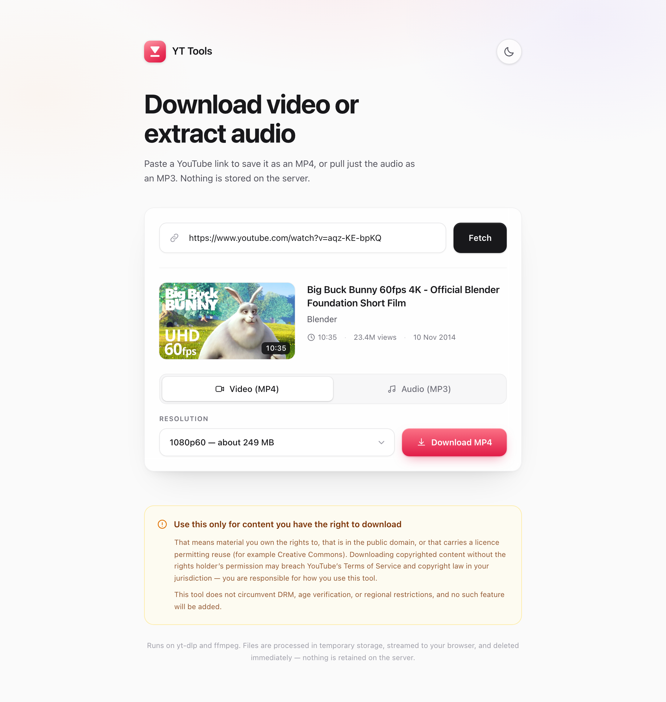
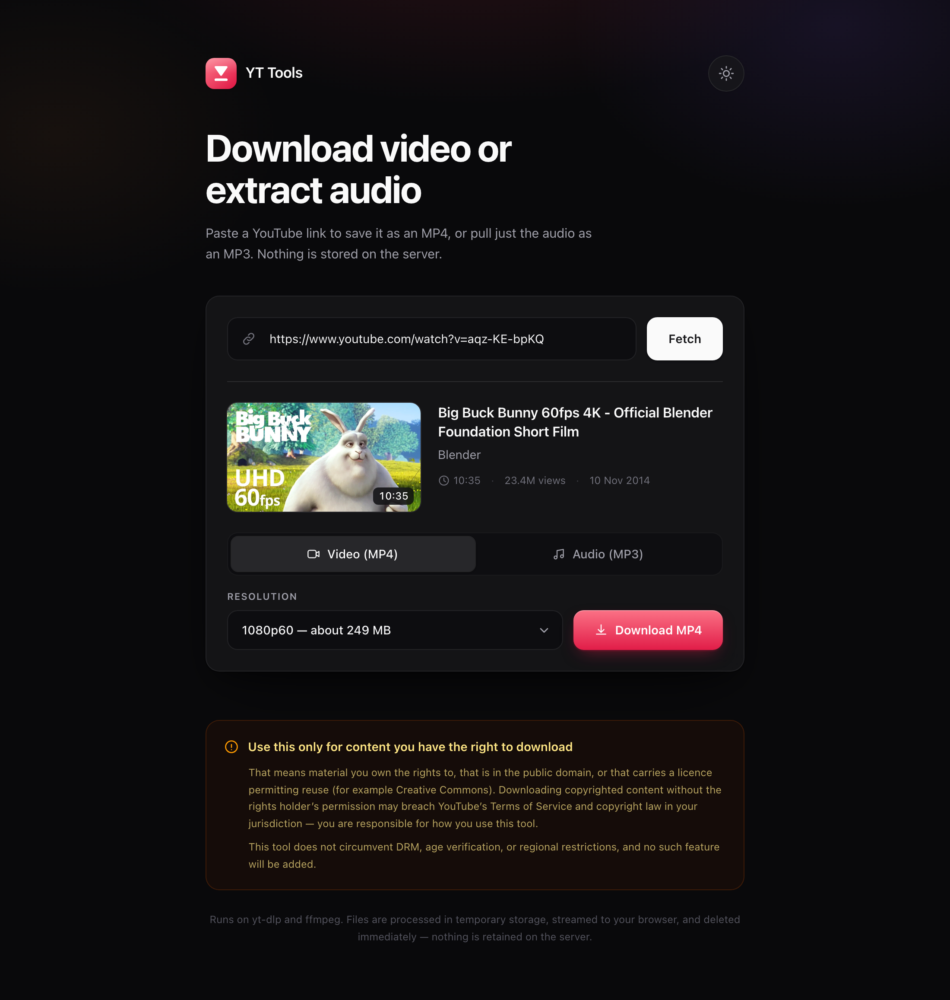
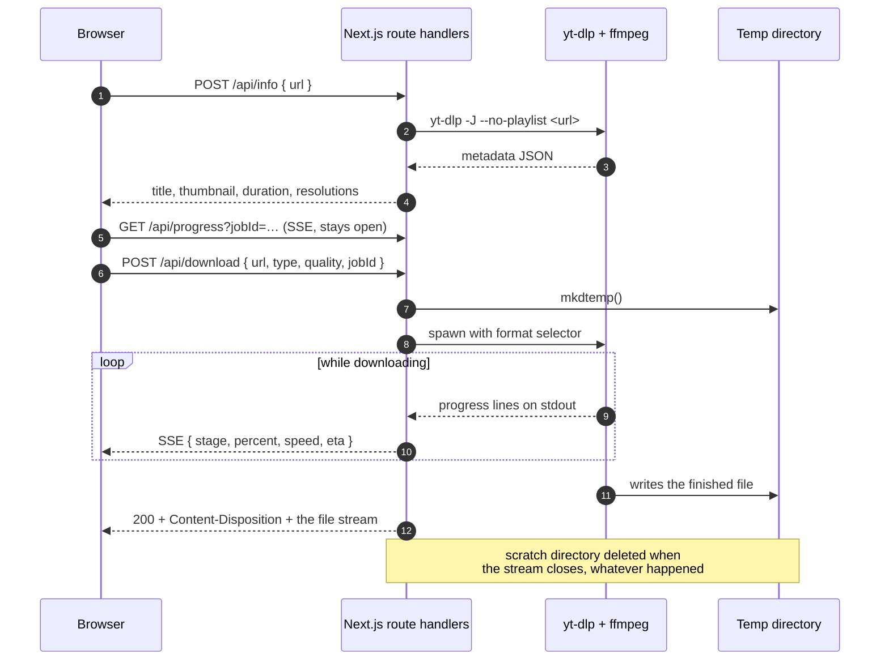

<div align="center">

<picture>
  <source media="(prefers-color-scheme: dark)" srcset="docs/logo-dark.png">
  
</picture>

<br>

**Paste a link, get an MP4** at the resolution you pick **or an MP3** at the bitrate you
pick. Nothing is ever stored on the server.

[](https://github.com/thomashendrixkw-code/yttools/actions/workflows/ci.yml)
[](LICENSE)
[](.nvmrc)
[](https://nextjs.org)




</div>

---

> [!IMPORTANT]
> **Use this only for content you have the right to download** — material you own, that is
> in the public domain, or that carries a licence permitting reuse (Creative Commons, for
> example). Downloading copyrighted content without the rights holder's permission may
> breach YouTube's Terms of Service and copyright law in your jurisdiction.
>
> This tool does not circumvent DRM, age verification, or regional restrictions, and no
> such feature will be added. See [SECURITY.md](SECURITY.md#deliberate-non-features).

---

## Contents

- [What it does](#what-it-does)
- [Quick start](#quick-start)
- [Requirements](#requirements)
- [Configuration](#configuration)
- [How it works](#how-it-works)
- [API reference](#api-reference)
- [Deployment](#deployment)
- [Known limitations](#known-limitations)
- [Troubleshooting](#troubleshooting)
- [Development](#development)
- [Design decisions](#design-decisions)

## What it does

- **MP4 downloads** at any resolution the video actually offers, each labelled with a size
  estimate. Prefers H.264 + AAC so the file plays everywhere, falling back to AV1/VP9 only
  above 1080p where YouTube publishes no H.264 rendition.
- **MP3 extraction** at 128 / 192 / 320 kbps, with the title, date and genre copied into
  ID3 tags.
- **Playlists** — pick entries from a checklist and get one ZIP back. A video that fails is
  skipped and listed in `SKIPPED.txt` rather than sinking the whole batch.
- **Honest progress.** Two phases, labelled separately: the server fetching and converting,
  then the finished file transferring to your browser.
- **Real error messages.** Private, removed, age-restricted, region-blocked, members-only,
  live and DRM-protected videos each produce a specific, actionable message.
- **Nothing retained.** Every request downloads into its own scratch directory, which is
  deleted the moment the response stream closes — on success, on failure, and on
  disconnect.
- Dark mode, download history in `localStorage`, and per-IP rate limiting.

## Quick start

### With Docker (recommended)

Everything — Node, Python, `yt-dlp`, `ffmpeg` — is in the image.

```bash
git clone https://github.com/thomashendrixkw-code/yttools.git
cd yttools
docker compose up --build
```

Open <http://localhost:3000>.

### In GitHub Codespaces

The repo ships a devcontainer that installs `yt-dlp` and `ffmpeg` for you, so
"Code → Codespaces → Create codespace" is enough to get running.

> [!WARNING]
> YouTube blocks datacenter IPs aggressively, and that is what Codespaces uses. Expect
> `BLOCKED_BY_YOUTUBE` on many videos even though the app is working — see
> [Troubleshooting](#troubleshooting). Codespaces is fine for working on the UI and the
> API surface; do real downloads locally.

### Locally

```bash
brew install yt-dlp ffmpeg     # see below for other platforms
npm install
npm run dev
```

Open <http://localhost:3000>. Visit `/api/health` to confirm both binaries were found — the
UI also shows a banner if either is missing.

## Requirements

| Tool                                         | Why                                                             |
| -------------------------------------------- | --------------------------------------------------------------- |
| Node.js ≥ 20.9                               | Runs the Next.js server                                         |
| [`yt-dlp`](https://github.com/yt-dlp/yt-dlp) | Fetches metadata and media                                      |
| [`ffmpeg`](https://ffmpeg.org/)              | MP3 encoding, and merging video + audio for anything above 720p |

Without `ffmpeg`, video downloads still work but fall back to progressive formats, which
top out at 720p; MP3 extraction is unavailable. The app detects this and adjusts rather
than producing a silent video.

<details>
<summary><strong>Installing the binaries on other platforms</strong></summary>

```bash
# Debian / Ubuntu
sudo apt-get install -y ffmpeg
sudo curl -fsSL https://github.com/yt-dlp/yt-dlp/releases/latest/download/yt-dlp_linux \
  -o /usr/local/bin/yt-dlp && sudo chmod a+rx /usr/local/bin/yt-dlp

# Arch
sudo pacman -S yt-dlp ffmpeg

# Windows (winget)
winget install yt-dlp.yt-dlp
winget install Gyan.FFmpeg

# Anywhere with Python
pipx install yt-dlp
```

Both are resolved from `PATH`, or from `YT_DLP_PATH` / `FFMPEG_PATH` if you set them.

</details>

## Configuration

Copy `.env.example` to `.env.local`. Every variable is optional.

| Variable               | Default         | Purpose                                                     |
| ---------------------- | --------------- | ----------------------------------------------------------- |
| `YT_DLP_PATH`          | _(PATH lookup)_ | Absolute path to the yt-dlp binary                          |
| `FFMPEG_PATH`          | _(PATH lookup)_ | Absolute path to the ffmpeg binary                          |
| `RATE_LIMIT_MAX`       | `10`            | Requests allowed per IP per window                          |
| `RATE_LIMIT_WINDOW_MS` | `60000`         | Rate-limit window length in ms                              |
| `DOWNLOAD_TIMEOUT_MS`  | `900000`        | Ceiling on a single yt-dlp invocation (15 min)              |
| `MAX_PLAYLIST_ITEMS`   | `25`            | Cap on playlist entries per batch                           |
| `YT_DLP_COOKIES`       | _(unset)_       | Path to a `cookies.txt` for content your account can access |

> [!NOTE]
> `YT_DLP_COOKIES` exists so you can download content **your own account already has
> legitimate access to** — not to bypass an age gate or a region lock.

## How it works



The two-phase progress is deliberate. The server-side phase (yt-dlp fetching and ffmpeg
converting) and the browser-side phase (that file coming down the wire) measure genuinely
different things, and no single percentage honestly combines them — so the UI labels them
"Step 1 of 2" and "Step 2 of 2" instead of inventing a number.

`/api/progress` is **purely cosmetic**. If it never connects — a proxy that buffers SSE, a
second replica, an ad blocker — the download itself is unaffected and the bar simply stays
indeterminate.

## API reference

Every endpoint is a Next.js route handler running on the Node runtime.

### `POST /api/info`

```jsonc
// Request
{ "url": "https://www.youtube.com/watch?v=aqz-KE-bpKQ" }
```

```jsonc
// Response — a single video
{
  "kind": "video",
  "video": {
    "id": "aqz-KE-bpKQ",
    "title": "Big Buck Bunny 60fps 4K - Official Blender Foundation Short Film",
    "channel": "Blender",
    "duration": 635,
    "thumbnail": "https://i.ytimg.com/…",
    "viewCount": 23352374,
    "uploadDate": "20141110",
    "webpageUrl": "https://www.youtube.com/watch?v=aqz-KE-bpKQ",
    "isLive": false,
    "qualities": [
      { "height": 2160, "label": "2160p60", "approxBytes": 1366140502, "fps": 60 },
      { "height": 1080, "label": "1080p60", "approxBytes": 261490674, "fps": 60 },
    ],
  },
}
```

A playlist URL returns `{ "kind": "playlist", "playlist": { … } }` with a flat list of
entries. A `watch?v=…&list=…` URL is treated as a **single video** — that is what the user
clicked on.

### `POST /api/download`

```jsonc
{
  "url": "https://www.youtube.com/watch?v=…",
  "type": "video", // "video" | "audio"
  "quality": 1080, // height in px for video, kbps for audio
  "jobId": "abc123", // optional — correlates with GET /api/progress
  "batchUrls": [], // optional — download many, return a ZIP
  "batchName": "My playlist", // optional — names the ZIP
}
```

Responds with the media stream, `Content-Type`, `Content-Disposition` (RFC 5987 encoded so
non-ASCII titles survive), and — for single files — `Content-Length`, which is what lets the
browser show a real transfer bar.

### `GET /api/progress?jobId=…`

Server-Sent Events carrying `{ stage, percent, speed, eta, detail }`, where `stage` is one
of `queued`, `downloading`, `merging`, `converting`, `packaging`, `done`, `error`.

### `GET /api/health`

```json
{
  "ytDlp": { "available": true, "version": "2026.08.19", "path": "/opt/homebrew/bin/yt-dlp" },
  "ffmpeg": { "available": true, "version": "9.0.1", "path": "/opt/homebrew/bin/ffmpeg" }
}
```

### Errors

Every failure returns the same envelope with a matching HTTP status:

```json
{
  "error": {
    "code": "AGE_RESTRICTED",
    "message": "This video is age-restricted.",
    "hint": "This tool does not bypass age gates. Download it from an account that already has access, using your own exported cookies."
  }
}
```

| Code                                              | Status  | When                                 |
| ------------------------------------------------- | ------- | ------------------------------------ |
| `INVALID_URL`, `INVALID_REQUEST`                  | 400     | Bad input                            |
| `NOT_FOUND`                                       | 404     | Removed or nonexistent video         |
| `PRIVATE_VIDEO`, `AGE_RESTRICTED`, `MEMBERS_ONLY` | 403     | You do not have access               |
| `DRM_PROTECTED`                                   | 403     | Cannot be downloaded, by design      |
| `GEO_BLOCKED`                                     | 451     | Not available in the server's region |
| `LIVE_STREAM`                                     | 400     | Currently live or upcoming           |
| `NO_MATCHING_FORMAT`                              | 422     | That quality does not exist          |
| `PLAYLIST_TOO_LARGE`                              | 400     | Batch exceeds `MAX_PLAYLIST_ITEMS`   |
| `RATE_LIMITED`                                    | 429     | Too many requests from your IP       |
| `BLOCKED_BY_YOUTUBE`                              | 429     | YouTube refused this server's IP     |
| `MISSING_BINARY`                                  | 503     | yt-dlp or ffmpeg not installed       |
| `TIMEOUT`                                         | 504     | Exceeded `DOWNLOAD_TIMEOUT_MS`       |
| `CONVERSION_FAILED`, `UNKNOWN`                    | 500/502 | Something else went wrong            |

## Deployment

Standard Vercel serverless and edge functions **cannot** run this: they have no `yt-dlp` or
`ffmpeg`, and their execution limits rule out long downloads. Use the Docker image on
Railway, Fly.io, Render, or any VPS.

```bash
docker compose up --build -d
# or
docker build -t yttools . && docker run -p 3000:3000 --tmpfs /tmp:size=8g yttools
```

The image installs Python, the standalone `yt-dlp` binary and `ffmpeg` alongside Node, runs
as a non-root user, and exposes a healthcheck on `/api/health`. CI builds it on every PR and
asserts that both binaries are present inside the running container.

Three things to plan for:

- **Put it behind auth.** Anyone who can reach the app can make your server download large
  files and hammer YouTube from your IP. The rate limiter is a courtesy, not a defence.
- **Disk.** Each in-flight download needs room for its file. `docker-compose.yml` mounts
  `/tmp` as an 8 GB tmpfs so nothing touches disk — size it for your traffic.
- **Replicas.** Rate-limit counters and progress state live in process memory. With more
  than one replica you want sticky sessions, or the progress bar falls back to
  indeterminate and each replica enforces its own limit independently.

> [!WARNING]
> Pin and periodically bump `YT_DLP_VERSION` in the Dockerfile. yt-dlp needs regular updates
> to keep working against YouTube; a months-old build will start failing.

## Known limitations

- **The browser buffers the whole file in memory.** The client reads the response into a
  `Blob` before saving it, so a 4K download of a long video can take a gigabyte of RAM on
  the client. Fine on a laptop, less fine on an old phone.
- **Progress and rate limiting are per-process**, so they do not survive a restart or span
  replicas.
- **Playlist batches are sequential**, capped at `MAX_PLAYLIST_ITEMS`, and the whole batch
  must finish before the ZIP starts streaming.
- **No authentication is built in.** That is deliberate — put it behind whatever your
  infrastructure already uses.
- **yt-dlp is a moving target.** When YouTube changes something, downloads break until
  yt-dlp ships a fix and you rebuild.

## Troubleshooting

<details>
<summary><strong>"yt-dlp is not installed on the server"</strong></summary>

The binary is not on `PATH`. Install it, or point `YT_DLP_PATH` at it. Check what the server
sees with `curl localhost:3000/api/health`.

</details>

<details>
<summary><strong>"YouTube is blocking requests from this server" (HTTP 429)</strong></summary>

YouTube challenges or refuses traffic it judges to be automated, and it is far more
aggressive about this from **datacenter IP addresses** — GitHub Codespaces, CI runners, and
most cloud VMs. The app is working correctly; YouTube is simply refusing it.

Options, best first:

1. **Run it from a residential connection.** Local machine, home server, or a VPS on an IP
   that has not been flagged.
2. **Supply cookies.** Export `cookies.txt` from a browser where you are signed in and set
   `YT_DLP_COOKIES` to its path. This proves you are a person, not a bot — it does not grant
   access to anything your account did not already have.
3. **Wait.** Short-lived challenges sometimes clear on their own.

The exact yt-dlp message is written to the server log, which is worth reading — it
distinguishes a block from a genuinely unavailable video.

</details>

<details>
<summary><strong>A request fails with 502 and "yt-dlp couldn't process that video"</strong></summary>

That is the catch-all for a yt-dlp failure with wording the app does not recognise. The
full stderr is **logged server-side** (look for `[yt-dlp] exited with code …` in the
terminal running the app); it is deliberately not returned to the browser, since it can
contain filesystem paths.

If the logged message looks like something the app should classify properly, please open an
issue with it — `tests/errors.test.ts` pins these strings.

</details>

<details>
<summary><strong>Resolutions above 720p are missing</strong></summary>

`ffmpeg` is not installed. YouTube serves anything above 720p as separate video and audio
tracks that have to be merged, and only ffmpeg can do that. Without it the app deliberately
restricts itself to progressive formats rather than handing you a silent video.

</details>

<details>
<summary><strong>The progress bar never shows a percentage</strong></summary>

The SSE connection is not getting through — usually a reverse proxy buffering the response.
The app already sends `X-Accel-Buffering: no`; for nginx also set `proxy_buffering off;` on
the location. Downloads work regardless; only the bar is affected.

</details>

<details>
<summary><strong>Downloads are slow</strong></summary>

Pick a lower resolution. The size estimate next to each option is a good predictor. 4K files
routinely run past a gigabyte, and the server has to fetch the whole thing before it can
start streaming it to you.

</details>

## Development

```bash
npm install
npm run dev          # http://localhost:3000
npm run check        # typecheck + lint + tests
npm run build
```

| Script                  | Does                         |
| ----------------------- | ---------------------------- |
| `npm run dev`           | Dev server with hot reload   |
| `npm run build`         | Production build             |
| `npm start`             | Serve the production build   |
| `npm run typecheck`     | `tsc --noEmit`               |
| `npm run lint`          | ESLint (Next.js flat config) |
| `npm run format`        | Prettier, write mode         |
| `npm test`              | Vitest, single run           |
| `npm run test:coverage` | Vitest with V8 coverage      |
| `npm run check`         | typecheck + lint + test      |

### Project layout

```
src/
  app/
    api/info/route.ts       yt-dlp -J metadata for a video or playlist
    api/download/route.ts   Spawns yt-dlp, streams the file, deletes the scratch dir
    api/progress/route.ts   SSE progress channel
    api/health/route.ts     Binary availability probe
    layout.tsx page.tsx     Shell, pre-paint theme bootstrap, the single page
  components/               Form, media card, tabs, playlist picker, toasts, footer
  hooks/
    useDownload.ts          fetch + SSE + save-to-disk, with cancellation
    useHistory.ts           localStorage as an external store
  lib/
    ytdlp.ts                All yt-dlp invocation and output parsing
    validate.ts             URL allowlist and request validation — the security boundary
    errors.ts               yt-dlp stderr → structured API errors
    binaries.ts             Locating yt-dlp / ffmpeg
    temp.ts                 Scratch directories and orphan sweeping
    progress.ts             In-process pub/sub behind the SSE endpoint
    rate-limit.ts format.ts types.ts
tests/                      Vitest: validation, error mapping, formatting
```

### Testing

`tests/` covers pure logic — 123 tests over URL validation, yt-dlp error mapping and
formatting. These are the places where a regression is silent and dangerous:
`parseYouTubeUrl` sits between a request body and a spawned subprocess, and the error
patterns are the only thing between a user and a generic failure message.

Code that shells out to yt-dlp is not unit-tested; it would depend on YouTube being
reachable and a specific video still existing. Verify those by hand against a Creative
Commons or public-domain video — [Big Buck Bunny](https://www.youtube.com/watch?v=aqz-KE-bpKQ)
(CC-BY, Blender Foundation) is a good one.

See [CONTRIBUTING.md](CONTRIBUTING.md) for conventions.

## Design decisions

<details>
<summary><strong>Why yt-dlp instead of a JavaScript library?</strong></summary>

YouTube changes its site regularly, and each change breaks extraction. yt-dlp has a large
community and ships fixes within days; pure-JS ports like `ytdl-core` routinely sit broken
for weeks. Shelling out to a Python binary is less elegant than an npm install, and far more
likely to still work next month.

</details>

<details>
<summary><strong>Why no database?</strong></summary>

There is nothing worth persisting. Metadata comes from YouTube on demand, files are
transient by design, and download history is a per-browser convenience that belongs in
`localStorage`. Adding a database would mostly add a thing that can be breached.

</details>

<details>
<summary><strong>Why download to a temp file instead of piping yt-dlp straight to the response?</strong></summary>

Merging separate video and audio tracks needs a seekable output, so anything above 720p
cannot stream directly. Writing to a scratch directory also means the response carries a
real `Content-Length` — which is what gives the browser an accurate transfer bar — and that
a mid-download failure returns a clean JSON error instead of a truncated file.

</details>

<details>
<summary><strong>Why is the file found by listing the directory?</strong></summary>

yt-dlp sanitises output filenames in ways that are tedious to predict. Giving each request
its own `mkdtemp` directory turns "what did it call the file?" into "what is in this
directory?", which is exact.

</details>

## Contributing

Bug reports and pull requests are welcome — see [CONTRIBUTING.md](CONTRIBUTING.md) and the
[Code of Conduct](CODE_OF_CONDUCT.md). For security issues, please follow
[SECURITY.md](SECURITY.md) rather than opening a public issue.

## Licence

[MIT](LICENSE) © Thomas Hendrickx.

The licence covers the source code. It grants no rights over the content this software is
used to download.
